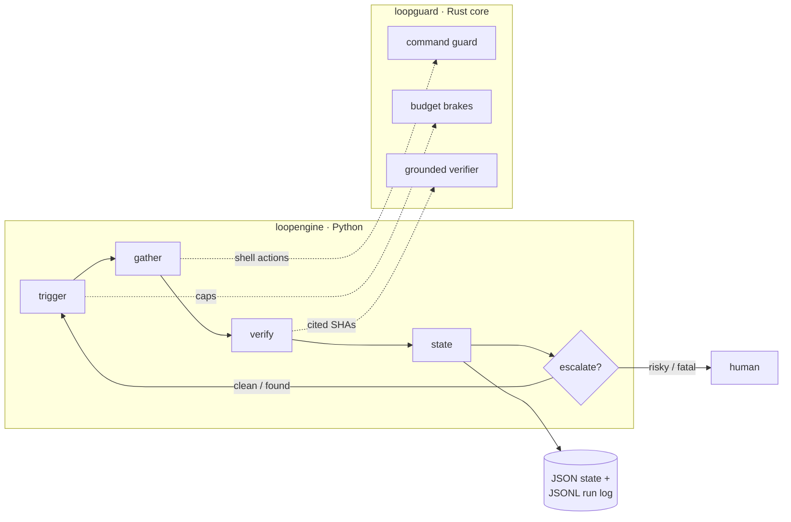

<div align="center">

# Strive Engineering

**A loop-engineering runtime — the system that prompts your agents, so you don't have to.**

A polyglot toolkit for designing, running, verifying, and observing autonomous
agent *loops* — with the constraint-critical machinery in a tested **Rust** core
and the orchestration in **Python**.

[](https://github.com/krishddd/Strive_Engineering/actions/workflows/ci.yml)
[](LICENSE)


</div>

---

## What is this?

**Loop engineering is replacing yourself as the person who prompts the agent — you
build the system that does it instead.** A loop earns its name only if it has all
four of these; missing any one, it's just a *harness*:

| | |
|---|---|
| 🫀 **Trigger** | a cadence or event wakes the loop |
| ✅ **Verifier** | an external, ungameable check proves the work — not the agent's own word |
| 🧠 **External state** | durable memory that survives between runs |
| 🛑 **Stop / escalate** | it knows when to quit or hand off to a human |

Strive Engineering gives you all four as reusable infrastructure, plus the hard
brakes and safety guards that make an *unattended* loop trustworthy. The first
built-in loop, `git-commit-triage`, watches a repo's commits read-only and writes
a prioritized, **source-cited** report — changing nothing.

## Why Rust *and* Python

The research that drives this repo is blunt: *"the code is written by the loop, but
the engineering resides entirely in the constraints."* So the constraints live in
**Rust**, where they can be deterministic and exhaustively tested; the orchestration
lives in **Python**, where iteration is fast.



The language boundary is **subprocess + JSON** (Python calls the `loopguard`
binary) — no FFI or maturin build step.

| Component | Language | Owns |
|---|---|---|
| [`crates/loopguard`](crates/loopguard) | **Rust** | Deterministic **command guard** (denylist), hard **budget / iteration / wall-clock brakes**, **grounded verification** (commit-SHA existence), a **reward-hacking / diff-integrity scanner**, and a **prompt-injection scanner**. Library + JSON CLI. |
| [`loopengine/`](loopengine) | **Python** | The **runtime**: trigger → gather → verify → state → escalate; **self-consistency voting**, **Reflexion-style retry**, JSON-schema-validated specs, external state + run log; CLI. |
| [`schemas/`](schemas) | **JSON Schema** | The `loop.json` contract every loop is validated against. |
| [`dashboard/`](dashboard) | **HTML/JS** | Read-only observability: state, findings, run log, budget. |

## The verifier is the whole game

A loop iterates *until a check passes*, which makes it a **Goodhart amplifier**: any
gap between "passes the check" and "is actually correct" gets brute-forced into an
exploit (tell it "make tests pass" with an exit-code check and it learns to delete
the failing test). The defence is a verifier the optimizer *cannot game*.

Here, every reported finding cites a commit SHA, and `loopguard` confirms each one
resolves in the target repo (`git cat-file -e`). A SHA either exists or it doesn't —
there is nothing to talk past. A finding with an unresolvable SHA makes the **whole
run invalid**, not merely flagged. See [docs/](docs/) for the full critique.

### Hardened against the ways loops actually cheat (research-driven)

The defences below each implement a specific result from the literature — full
annotated bibliography in [`docs/research-arxiv.md`](docs/research-arxiv.md):

| Threat | Defence | Source |
|---|---|---|
| Agent passes a check by **deleting the test / weakening the assertion / editing the eval harness** | `loopguard scan-diff` flags removed tests, added skip markers, removed assertions, and edits to test/eval/CI files → auto-escalate | Reward Hacking Benchmark (2605.02964); RLVR verifier gaming (2604.15149) |
| **Indirect prompt injection** via ingested tool returns | `loopguard scan-injection` scores instruction-override / role-spoof / exfiltration before the loop acts (verify-before-commit) | Task Shield (2412.16682); IPIGuard (2508.15310); VIGIL (2601.05755) |
| **LLM-judge is inconsistent / self-preferring** | never let the maker grade itself; `majority_vote` requires consensus across N independent verdicts and escalates on disagreement | Rating Roulette (2510.27106); Reliability without Validity (2606.19544) |
| **Blind retry oscillates** | `run_reflexion` feeds the checker's reason-for-failure into the next attempt, bounded by the iteration cap | Reflexion (2303.11366); Self-Refine (2303.17651) |

## The six primitives → where they live

| Primitive | In this repo |
|---|---|
| Automations / scheduling | loop `cadence` + the runtime's single-pass trigger |
| Worktrees (isolation) | `loopengine.worktree` — every assisted-fix attempt runs in an isolated worktree |
| Skills (codified knowledge) | loop specs + `docs/` patterns |
| Connectors (MCP) | none yet — read-only `git` only, zero write scope |
| Sub-agents (maker/checker) | the **assisted-fix** loop: maker proposes, checker (integrity + tests) verifies |
| Memory / external state | `loopengine.state` — JSON state + JSONL run log |

## Quick start

```bash
# 1. Build the Rust constraints core → target/release/loopguard
cargo build --release

# 2. Install the Python runtime
pip install -e "loopengine[dev]"

# 3. Poke the constraints core directly
loopengine guard "git push --force origin main"   # → BLOCK (exit 2)
loopengine guard "git log -5"                      # → allow
loopengine verify /path/to/repo <real-sha> <fake>  # → grounded vs fabricated
git diff | loopengine scan-diff -                   # → flags test-deletion (exit 5)
loopengine scan-injection suspicious.txt            # → flags prompt injection (exit 6)

# 4. Run a loop (report-only). Copy the example, point it at a real repo:
cp loops/example-triage.json loops/local-mine.json   # edit target.repo
loopengine run loops/local-mine.json
loopengine show .loop-state/state.json example-triage
```

Open [`dashboard/index.html`](dashboard/index.html) in a browser and drop your
`.loop-state/state.json` onto it to see findings and run history.

## Project layout

```
Strive_Engineering/
├── crates/loopguard/      # Rust: guard + budget + verifier (lib + CLI), 13 tests
├── loopengine/            # Python: runtime, state, CLI, git-commit-triage, 5 tests
├── schemas/               # JSON Schema for a loop spec
├── loops/                 # example loop definitions (real targets stay gitignored)
├── dashboard/             # HTML/JS observability viewer
├── docs/                  # concepts, verification critique, safety, failure modes
└── .github/workflows/     # CI: fmt + clippy + cargo test + pytest
```

## The assisted-fix loop (L2)

`assisted-fix` is the maker/checker loop, end to end:

```
worktree off base_ref → maker proposes an edit → checker gates it:
   1. integrity scan of the diff   (deleted test / weakened assertion → ESCALATE, no retry)
   2. injection scan of the task   (prompt injection in the brief → ESCALATE)
   3. run test_command in worktree  (the ground-truth verifier)
→ on test failure: Reflexion feeds the reason into the next attempt (bounded by the cap)
→ on success: commit to a branch and leave it for a human — it never auto-merges
```

The maker is pluggable: inject a Python callable, or set `maker_command` in the
spec (the placeholder where you wire an agent/codegen step). Blast radius is a
throwaway branch in an isolated worktree; `main` is never touched. See
[`loops/example-assisted-fix.json`](loops/example-assisted-fix.json).

## Build phases — gate before advancing

`L0` manual → **`L1` report-only** (`git-commit-triage`) → **`L2` assisted PRs**
(`assisted-fix`: verifier + worktrees, propose-only) → `L3` unattended (tight
allowlist). Default posture: **start at L1, stay until boring.**

## Develop & test

```bash
cargo test                       # Rust unit tests (13)
cargo clippy --all-targets -- -D warnings
pip install -e "loopengine[dev]" && pytest loopengine/tests -q   # Python (5)
```

CI runs all of the above on every push, plus a manual-dispatch report-only
self-triage job.

## Status

- ✅ Rust `loopguard`: guard + budget + verifier + diff-integrity + injection scanners —
  **23 unit tests**, fmt + clippy clean.
- ✅ Python `loopengine`: runtime, state, CLI, self-consistency, Reflexion, schema
  validation, **worktree isolation**, and the **L2 `assisted-fix` loop** — **20 tests**;
  end-to-end coverage of triage `found → clean`, fatal escalation, the research features,
  and assisted-fix (success-via-reflexion, reward-hack-caught, cap-escalation, injection-blocked).
- ✅ JSON schema (per-kind conditional validation), example loops, dashboard, CI,
  [arXiv bibliography](docs/research-arxiv.md).
- 🚧 Planned: wire a real agent maker into `assisted-fix`; richer dashboard; MCP connectors
  behind the injection gate; L3 allowlist.

## License

[MIT](LICENSE) © krishddd
