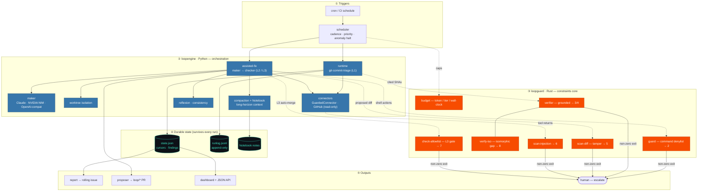
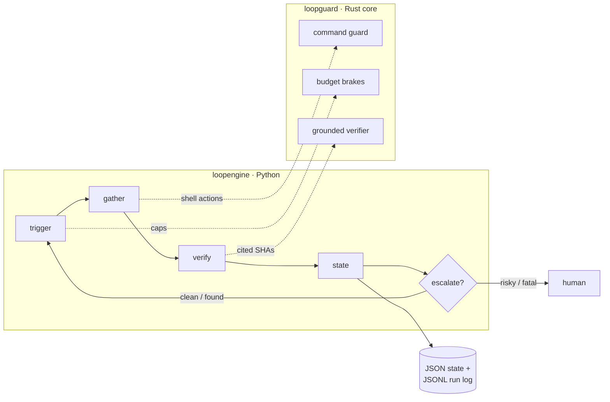

<div align="center">

# Strive Engineering

**A loop-engineering runtime — the system that prompts your agents, so you don't have to.**

A polyglot toolkit for designing, running, verifying, and observing autonomous
agent *loops* — with the constraint-critical machinery in a tested **Rust** core
and the orchestration in **Python**.

[](https://github.com/krishddd/Strive_Engineering/actions/workflows/ci.yml)
[](LICENSE)


</div>

---

## What is this?

**Loop engineering is replacing yourself as the person who prompts the agent — you
build the system that does it instead.** A loop earns its name only if it has all
four of these; missing any one, it's just a *harness*:

| | |
|---|---|
| 🫀 **Trigger** | a cadence or event wakes the loop |
| ✅ **Verifier** | an external, ungameable check proves the work — not the agent's own word |
| 🧠 **External state** | durable memory that survives between runs |
| 🛑 **Stop / escalate** | it knows when to quit or hand off to a human |

Strive Engineering gives you all four as reusable infrastructure, plus the hard
brakes and safety guards that make an *unattended* loop trustworthy. The first
built-in loop, `git-commit-triage`, watches a repo's commits read-only and writes
a prioritized, **source-cited** report — changing nothing.

## Architecture at a glance

Every arrow that leaves the orchestration and touches something risky — a shell
action, a cited SHA, an ingested tool return, a diff about to merge — is forced
through the **Rust core** first. The core is the only thing that can say *block*,
*fabricated*, *escalate*, *tamper*, or *injection*, and it says so with a stable
exit code the Python side branches on.


```mermaid
flowchart TB
    subgraph TRIG["① Triggers"]
        direction LR
        CRON["cron / CI schedule"]
        SCHED["scheduler<br/>cadence · priority · anomaly halt"]
    end

    subgraph PY["② loopengine · Python — orchestration"]
        direction TB
        RT["runtime<br/>git-commit-triage (L1)"]
        ASST["assisted-fix<br/>maker → checker (L2 / L3)"]
        MAKER["maker<br/>Claude · NVIDIA NIM · OpenAI-compat"]
        WT["worktree isolation"]
        CONN["connectors<br/>GuardedConnector · GitHub (read-only)"]
        LONG["compaction + Notebook<br/>long-horizon context"]
        REFLEX["reflexion · consistency"]
    end

    subgraph RS["③ loopguard · Rust — constraints core"]
        direction TB
        GUARD["guard — command denylist → 2"]
        BUDGET["budget — token / iter / wall-clock"]
        VERIFY["verifier — grounded → 3/4"]
        ISO["verify-iso — isomorphic gap → 8"]
        INTEG["scan-diff — tamper → 5"]
        INJECT["scan-injection → 6"]
        POLICY["check-allowlist — L3 gate → 7"]
    end

    subgraph STATE["④ Durable state (survives every run)"]
        direction LR
        JSON[("state.json<br/>cursors · findings")]
        LOG[("runlog.jsonl<br/>append-only")]
        NB[("Notebook notes")]
    end

    subgraph OUT["⑤ Outputs"]
        direction LR
        REPORT["report → rolling issue"]
        PROP["proposer → loop/* PR"]
        DASH["dashboard + JSON API"]
        HUMAN(["human — escalate"])
    end

    CRON --> SCHED --> RT
    SCHED --> ASST
    ASST --> MAKER
    ASST --> WT
    RT & ASST --> CONN
    ASST --> LONG
    ASST --> REFLEX

    ASST -. shell actions .-> GUARD
    RT -. cited SHAs .-> VERIFY
    VERIFY --- ISO
    ASST -. proposed diff .-> INTEG
    CONN -. tool returns .-> INJECT
    ASST -. L3 auto-merge .-> POLICY
    SCHED -. caps .-> BUDGET

    RT --> JSON
    RT --> LOG
    LONG --> NB

    JSON --> REPORT
    ASST --> PROP
    JSON --> DASH
    GUARD & VERIFY & INTEG & INJECT & POLICY -->|non-zero exit| HUMAN

    classDef rust fill:#f74c00,stroke:#b23600,color:#fff;
    classDef py fill:#3776ab,stroke:#274d6e,color:#fff;
    classDef store fill:#0d1117,stroke:#3ee8c5,color:#3ee8c5;
    class GUARD,BUDGET,VERIFY,ISO,INTEG,INJECT,POLICY rust;
    class RT,ASST,MAKER,WT,CONN,LONG,REFLEX py;
    class JSON,LOG,NB store;
```

## Why Rust *and* Python

The research that drives this repo is blunt: *"the code is written by the loop, but
the engineering resides entirely in the constraints."* So the constraints live in
**Rust**, where they can be deterministic and exhaustively tested; the orchestration
lives in **Python**, where iteration is fast.


```mermaid
flowchart LR
    subgraph PY["loopengine · Python"]
        T[trigger] --> G[gather] --> V[verify] --> S[state] --> E{escalate?}
    end
    subgraph RS["loopguard · Rust core"]
        GUARD[command guard]
        BUDGET[budget brakes]
        VERIFY[grounded verifier]
    end
    G -. shell actions .-> GUARD
    V -. cited SHAs .-> VERIFY
    T -. caps .-> BUDGET
    S --> JSON[(JSON state +<br/>JSONL run log)]
    E -->|risky / fatal| HUMAN[human]
    E -->|clean / found| T
```

The language boundary is **subprocess + JSON** (Python calls the `loopguard`
binary) — no FFI or maturin build step.

| Component | Language | Owns |
|---|---|---|
| [`crates/loopguard`](crates/loopguard) | **Rust** | Deterministic **command guard** (denylist), hard **budget / iteration / wall-clock brakes**, **grounded verification** (commit-SHA existence) plus **isomorphic-perturbation verification** (anti-reward-hacking), a **reward-hacking / diff-integrity scanner**, a **prompt-injection scanner**, and the **L3 allowlist policy gate**. Library + JSON CLI. |
| [`loopengine/`](loopengine) | **Python** | The **runtime** (trigger → gather → verify → state → escalate); **context compaction + structured note-taking** for long horizons; **self-consistency**, **Reflexion**, a **provider-agnostic agent maker** (Claude / free NVIDIA NIM / any OpenAI-compatible), **guarded MCP connectors** (incl. a structurally read-only **GitHub transport**), a **GitHub PR proposer** (the sanctioned L2 write), a **markdown loop reporter** (feeds the CI rolling issue), a **multi-loop scheduler with anomaly/oscillation halting**, **spec authoring/cost/audit** tooling, a **dashboard JSON API**, and JSON-schema-validated specs; CLI. |
| [`schemas/`](schemas) | **JSON Schema** | The `loop.json` contract every loop is validated against. |
| [`dashboard/`](dashboard) | **HTML/JS** | Read-only observability: live state, findings, run log, budget. |

## The verifier is the whole game

A loop iterates *until a check passes*, which makes it a **Goodhart amplifier**: any
gap between "passes the check" and "is actually correct" gets brute-forced into an
exploit (tell it "make tests pass" with an exit-code check and it learns to delete
the failing test). The defence is a verifier the optimizer *cannot game*.

Here, every reported finding cites a commit SHA, and `loopguard` confirms each one
resolves in the target repo (`git cat-file -e`). A SHA either exists or it doesn't —
there is nothing to talk past. A finding with an unresolvable SHA makes the **whole
run invalid**, not merely flagged. See [docs/](docs/) for the full critique.

**One predicate is still one predicate to game.** The deeper result in the 2026
literature is that *extensional* verification — a single literal check the optimizer
can target — itself *induces* reward hacking, while **isomorphic** verification (the
same claim checked under an independent-but-equivalent predicate) prevents it. So
`loopguard verify-iso` confirms each SHA twice: the literal `cat-file -e`, **and** an
isomorphic variant that re-derives the *full* 40-hex oid, demands its object type is
exactly `commit`, and demands the claimed SHA be a true prefix of it. They agree for
an honest reference; a **gap** (passes one ungameable check but not its equivalent —
an ambiguous prefix, a tag masquerading as a commit) is the shortcut signature and
escalates with its own exit code (8).

### Hardened against the ways loops actually cheat (research-driven)

The defences below each implement a specific result from the literature — full
annotated bibliography in [`docs/research-arxiv.md`](docs/research-arxiv.md):

| Threat | Defence | Source |
|---|---|---|
| Agent passes a check by **deleting the test / weakening the assertion / editing the eval harness** | `loopguard scan-diff` flags removed tests, added skip markers, removed assertions, and edits to test/eval/CI files → auto-escalate | Reward Hacking Benchmark (2605.02964); RLVR verifier gaming (2604.15149) |
| Agent games a **single literal verifier** because one predicate is one shortcut | `loopguard verify-iso` checks each claim under two equivalent predicates and escalates on any gap (isomorphic ≫ extensional verification) | LLMs Gaming Verifiers (2604.15149); Contrastive reward-hack detection in code (2601.20103) |
| **Indirect prompt injection** via ingested tool returns | `loopguard scan-injection` scores instruction-override / role-spoof / exfiltration before the loop acts (verify-before-commit) | Task Shield (2412.16682); IPIGuard (2508.15310); VIGIL (2601.05755) |
| **LLM-judge is inconsistent / self-preferring** | never let the maker grade itself; `majority_vote` requires consensus across N independent verdicts and escalates on disagreement | Rating Roulette (2510.27106); Reliability without Validity (2606.19544) |
| **Blind retry oscillates** | `run_reflexion` feeds the checker's reason-for-failure into the next attempt, bounded by the iteration cap | Reflexion (2303.11366); Self-Refine (2303.17651) |

## The six primitives → where they live

| Primitive | In this repo |
|---|---|
| Automations / scheduling | `loopengine.scheduler` — multi-loop ticks: cadence, priority, triage-inbox, collision guard, **anomaly/oscillation halting** |
| Worktrees (isolation) | `loopengine.worktree` — every assisted-fix attempt runs in an isolated worktree |
| Skills (codified knowledge) | loop specs + `docs/` patterns |
| Connectors (MCP) | `loopengine.connectors` — live JSON-RPC `HttpMCPTransport` + a structurally read-only `GitHubTransport` (PRs / issues / workflow runs); every tool return is injection-scanned before the loop acts (read-only by default) |
| Sub-agents (maker/checker) | the **assisted-fix** loop: maker proposes, checker (integrity + tests) verifies |
| Memory / external state | `loopengine.state` — JSON state + JSONL run log; `loopengine.compaction.Notebook` for durable structured notes |
| Context management (long horizons) | `loopengine.compaction` — threshold-driven compaction + structured note-taking so many-iteration loops don't overflow context |

## Keeping long loops honest — context compaction + structured notes

A loop that runs many iterations accumulates transcript faster than intuition
suggests, and a coding agent's context window is finite — so a long-horizon loop
either overflows or silently drops the early decisions that still matter. Anthropic's
*Effective Context Engineering for AI Agents* names the levers; `loopengine.compaction`
implements the two highest-leverage ones as **structural brakes**, not nice-to-haves:

- **Compaction** (`Compactor`) — when the running transcript crosses a token threshold,
  fold the older turns into one summary that preserves decisions and open bugs, **drop
  the redundant tool outputs** (the bulk of the tokens, almost never re-read), and keep
  the recent tail verbatim. The summarizer is injected, so it's deterministic and
  testable; the default `extractive_summary` is dependency-free.
- **Structured note-taking** (`Notebook`) — durable scratch memory *outside* the
  transcript, backed by the state spine, so a note survives both compaction and process
  exit. The agent's `NOTES.md`, but in the loop's state file.

```python
from loopengine import Compactor, Message, Notebook, StateStore

comp = Compactor(threshold_tokens=12000, keep_recent=6)
result = comp.maybe_compact(transcript)      # no-op below threshold; folds older turns above it

nb = Notebook(StateStore(".loop-state/state.json"), "my-loop")
nb.add("decision: stay at L1 until the triage is boring")   # outlives the conversation
```

## Authoring & vetting a loop — `init` / `cost` / `audit`

Three CLI verbs make the runtime useful the moment you stand up a new loop, before a
single token is spent:

```bash
loopengine init my-loop --kind assisted-fix --out loops/my-loop.json  # schema-valid scaffold
loopengine cost  loops/my-loop.json     # per-run & per-day token estimate vs the budget cap
loopengine audit loops/my-loop.json     # score readiness across the L0→L3 ladder + fixes
```

`audit` scores a spec against the four things that *make* it a loop — trigger, verifier,
external state, stop/escalate — plus the safety gates, and reports the highest phase it
is **structurally** ready for, independent of the phase it declares. A spec that claims
L3 but has no allowlist is told so (and the command exits non-zero), which is exactly the
CLAUDE.md §5 discipline — *advance only when ready* — turned into a check.

## Quick start

```bash
# 1. Build the Rust constraints core → target/release/loopguard
cargo build --release

# 2. Install the Python runtime
pip install -e "loopengine[dev]"

# 3. Poke the constraints core directly
loopengine guard "git push --force origin main"   # → BLOCK (exit 2)
loopengine guard "git log -5"                      # → allow
loopengine verify /path/to/repo <real-sha> <fake>   # → grounded vs fabricated (exit 3/4)
loopengine verify-iso /path/to/repo <sha>...        # → isomorphic check; gap → escalate (exit 8)
git diff | loopengine scan-diff -                   # → flags test-deletion (exit 5)
loopengine scan-injection suspicious.txt            # → flags prompt injection (exit 6)

# 4. Run a loop (report-only). Copy the example, point it at a real repo:
cp loops/example-triage.json loops/local-mine.json   # edit target.repo
loopengine run loops/local-mine.json
loopengine show .loop-state/state.json example-triage
```

```bash
# 5. Run every due loop in a directory once (cadence + priority + triage-inbox)
loopengine schedule loops/ --state .loop-state/state.json

# 6. Serve the read-only dashboard + JSON API (GET /api/state, /api/runlog)
loopengine serve --state .loop-state/state.json --port 8765
```

Open the dashboard at `http://127.0.0.1:8765` and click **Load live**, or open
[`dashboard/index.html`](dashboard/index.html) directly and drop a `state.json` onto it.

## Project layout

```
Strive_Engineering/
├── crates/loopguard/      # Rust core: guard, budget, verifier (+ isomorphic),
│                          #   integrity, injection, policy (lib + JSON CLI) — 34 tests
├── loopengine/            # Python runtime: runtime, prtriage, assisted, makers,
│                          #   connectors, scheduler (+ anomaly guard), compaction,
│                          #   authoring, report, proposer, reflexion, consistency,
│                          #   dashboard_api, CLI — 101 tests
├── schemas/               # JSON Schema for a loop spec
├── loops/                 # example loop definitions (real targets stay gitignored)
├── dashboard/             # HTML/JS observability viewer (+ live JSON API)
├── scripts/               # helper/verifier scripts a hook calls (guard_bash, scrub_mojibake)
├── .claude/               # enforcement layer: PreToolUse hook config (settings.json)
├── docs/                  # concepts, verification critique, safety, failure modes, arXiv refs
└── .github/workflows/     # CI: fmt + clippy + cargo test + pytest
                           #   + the daily-triage loop (cron → loop-state branch → rolling issue)
```

## The assisted-fix loop (L2)

`assisted-fix` is the maker/checker loop, end to end:

```
worktree off base_ref → maker proposes an edit → checker gates it:
   1. integrity scan of the diff   (deleted test / weakened assertion → ESCALATE, no retry)
   2. injection scan of the task   (prompt injection in the brief → ESCALATE)
   3. run test_command in worktree  (the ground-truth verifier)
→ on test failure: Reflexion feeds the reason into the next attempt (bounded by the cap)
→ on success: commit to a branch and leave it for a human — it never auto-merges
→ optional last mile: the proposer pushes the loop/* branch and opens a PR
   whose body carries the verifier evidence (test command, attempts, reflections)
```

The **proposer** (`"proposer": {"type": "github"}` in the spec) is the one
sanctioned L2 write — see [docs/safety.md](docs/safety.md). Its limits are
enforced in code, not prose: it fires only on a `proposed` result, pushes only
`loop/*` branches with an explicit refspec (never `--force`), and a delivery
failure leaves the local branch intact and stops — no retry loop.

The maker is where the loop **actually prompts an agent**. It's pluggable across
providers:

- `"maker": {"type": "nvidia", "model": "meta/llama-3.3-70b-instruct"}` — a **free**
  model via [NVIDIA NIM](https://build.nvidia.com) (OpenAI-compatible, no card, set
  `NVIDIA_API_KEY`). **No extra dependency** — stdlib HTTP only. See *Free models* below.
- `"maker": {"type": "llm", "model": "claude-opus-4-8"}` — a **Claude-backed
  implementer**. Install `pip install -e "loopengine[llm]"`, set `ANTHROPIC_API_KEY`.
- `"maker": {"type": "openai", "base_url": "...", "model": "...", "api_key_env": "..."}`
  — any OpenAI-compatible endpoint (Groq, OpenRouter, a local NIM container, …).
- `"maker_command": "..."` — a shell command run in the worktree; or inject any
  Python callable programmatically.

### Free models for development (NVIDIA NIM)

NVIDIA's [build.nvidia.com](https://build.nvidia.com) gives free, OpenAI-compatible
API access (~40 req/min, no credit card) to 100+ models. Recommended picks for this
pipeline — switching is a one-line `model` change:

| Use | Model id | Why |
|---|---|---|
| **Assisted-fix maker (default)** | `meta/llama-3.3-70b-instruct` | Reliable JSON / structured output, fast, free |
| **Best code quality** | `qwen/qwen3-coder-480b-a35b-instruct` | Purpose-built for agentic coding |
| **Reasoning-heavy fixes** | `deepseek-ai/deepseek-r1` | Strong reasoning (the maker strips its `<think>` blocks) |
| **Cheap/fast side tasks** | `meta/llama-3.1-8b-instruct` | Lowest latency for light work |

```bash
export NVIDIA_API_KEY=nvapi-...          # free key from build.nvidia.com
loopengine run loops/example-l3-autofix.json   # spec uses {"type":"nvidia",...}
```

The same maker also works with other free OpenAI-compatible tiers (Groq, Google AI
Studio via a proxy, OpenRouter free models) — use `{"type":"openai","base_url":...}`.

Whatever the maker proposes is still gated by the integrity scanner and the test
command — a model that tries to delete the failing test is caught and escalated,
not merged. Blast radius is a throwaway branch in an isolated worktree; `main` is
never touched. See [`loops/example-assisted-fix.json`](loops/example-assisted-fix.json).

### L3 — unattended, allowlist-gated (`assisted-fix` with `phase: "L3"`)

At L3 the loop may act on its own — but only inside a tight allowlist. After the
verifier passes, the diff goes through a deterministic **allowlist gate**
(`loopguard check-allowlist`): it auto-merges into `base_ref` (a fast-forward —
never a force-push) **only if** every file matches an allow glob, none match a
deny glob, it's within the file/line caps, and it's integrity-clean. Anything
else falls back to L2 behavior — propose a branch and escalate. It also refuses to
move `base_ref` if that branch is checked out in the target. Default deny list
covers `auth/`, `payments/`, `secrets/`, `migrations/`, CI workflows, and more.

### Connectors (MCP) — reach out, but verify first

`loopengine.connectors.GuardedConnector` wraps any MCP transport so **every tool
return is run through the injection scanner before the loop can act on it**
(verify-before-commit). Connectors are read-only by default; write tools require
explicit, L3-only scope. The transport is injected, so there is no path to act on
an unscanned result.

The built-in `GitHubTransport` reads PRs, issues, and workflow runs for a repo —
and is **structurally** read-only: every tool maps to an HTTP GET and no mutating
code path exists, so even a misconfigured `scope: write` grant cannot turn it into
a write connector. Issue/PR bodies (classic indirect-injection carriers) are capped
and pass the same injection gate as any other tool return.

The **`pr-triage`** loop kind puts that connector to work: it triages a repo's open
PRs read-only (cursor-gated, so a quiet day is a *clean* run, not a re-report),
buckets them (a bot `loop/*` proposal awaiting review or a `fix:`/`security` PR is
*high*, drafts are *noise*), and cites each finding's real PR number. It stays L1
by design — its grounding (injection-scanned API data) is weaker than commit-triage's
loopguard-resolved SHAs, so it reports, it never acts. See
[`loops/example-pr-triage.json`](loops/example-pr-triage.json).

## Build phases — gate before advancing

`L0` manual → **`L1` report-only** (`git-commit-triage`, `pr-triage`) → **`L2` assisted PRs**
(`assisted-fix`: verifier + worktrees, propose-only) → **`L3` unattended**
(`assisted-fix` + allowlist auto-merge). Default posture: **start at L1, stay
until boring.**

## Develop & test

```bash
cargo test                       # Rust unit tests (34)
cargo clippy --all-targets -- -D warnings
pip install -e "loopengine[dev]" && pytest loopengine/tests -q   # Python (86)
```

CI runs all of the above on every push. On a daily cron it also runs the
**closed self-triage loop**: restore cursors from the `loop-state` branch →
triage this repo (report-only L1) → publish actionable findings to a rolling
issue labeled `loop-report`, or, on a clean run, edit that issue to a
"resolved — nothing outstanding" banner (closing it after a clean streak) so the
inbox reflects reality → persist state back to the `loop-state` branch.

### Enforcement layer (hooks)

CLAUDE.md's safety rules are advisory as prose; the ones that must hold every time
are turned into a **PreToolUse hook** (`.claude/settings.json` →
[`scripts/hooks/guard_bash.py`](scripts/hooks/guard_bash.py)) that blocks
force-push, `rm -rf`, and history-rewrite in interactive sessions — the same
denylist discipline the Rust `loopguard` applies to loop-spawned commands, now
covering the human-in-the-loop half too.

## Status

- ✅ Rust `loopguard`: guard + budget + grounded verifier + **isomorphic-perturbation
  verifier** + diff-integrity + injection scanners + **L3 allowlist policy gate** —
  **34 unit tests**, fmt + clippy clean.
- ✅ Python `loopengine`: runtime, state, CLI, self-consistency, Reflexion, schema
  validation, worktree isolation, `assisted-fix` (L2 propose / L3 auto-merge), a
  **provider-agnostic agent maker** (Claude + free NVIDIA NIM / any OpenAI-compatible),
  **guarded MCP connectors** (live JSON-RPC transport + a **structurally read-only
  GitHub transport**), a **GitHub PR proposer** (loop/* branches only, never force),
  a **markdown loop reporter**, a **multi-loop scheduler**
  (cadence + priority + triage-inbox + collision guard + **anomaly/oscillation halting**),
  **context compaction + structured note-taking**, **spec authoring/cost/audit** tooling,
  a **read-only `pr-triage` loop** over the guarded GitHub connector, and a
  **read-only dashboard JSON API** — **101 tests**; all deterministic (injected clock
  / runner / transport / summarizer — no sockets).
- ✅ JSON schema (per-kind conditional validation), example loops, dashboard, CI,
  [arXiv bibliography](docs/research-arxiv.md).
- ✅ **The loop is closed on GitHub**: daily cron triage with durable cursors on a
  `loop-state` branch and a rolling `loop-report` issue; L2 results delivered as PRs
  carrying their verifier evidence.
- ✅ **Full L0→L3 ladder shipped** + scheduling, connectors, long-horizon context
  management, and observability. Optional next: a PR-triage loop kind on the GitHub
  connector; packaging the CLIs for distribution; richer dashboard.

## License

[MIT](LICENSE) © krishddd
